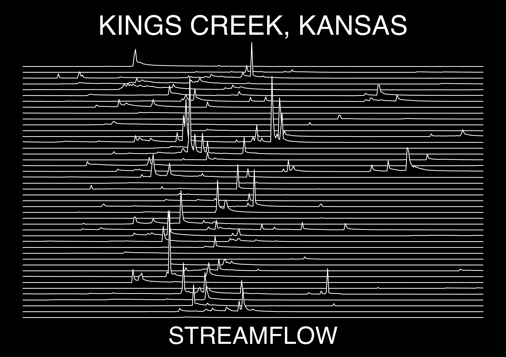

# StreamRidges
<<<<<<< HEAD
Code to create ridgeline plots using USGS gages and ggridges. Just provide the USGS gage number, start, and end dates of the water years you want.
=======
Create ridgeline plots using USGS gages and ggridges. Just provide the USGS gage number, start, and end dates of the water years you want.
>>>>>>> bcef64c (update README)

